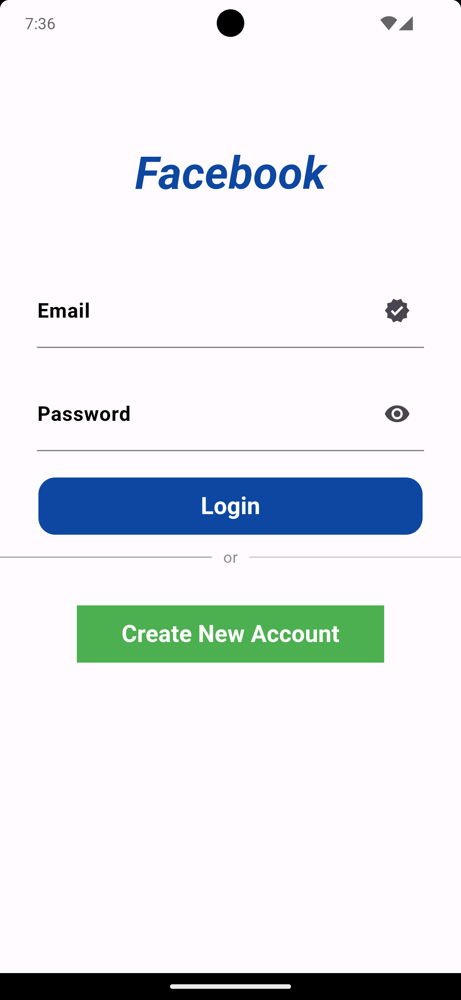

# Ecommerce_app_project

A new Flutter project.

## Getting Started

<b>Overview:</b>
[Ecommerce App] is a small e-commerce application built using Flutter, providing users with a modern and intuitive platform to browse.

<b>Features:</b>
User Authentication: Secure user authentication and authorization mechanisms.
Responsive Design: Ensures a seamless user experience across various screen sizes.

<b>Technologies Used:</b>
Flutter: UI toolkit for building natively compiled applications for mobile, web, and desktop.
<b>CommerceJs:</b> Commerce.js is an API-first e-commerce platform that enables developers to build custom e-commerce solutions using their preferred technology stack.
<b>Version Control:</b> Git

<b>Contributing:</b>
Contributions are welcome! Feel free to fork this repository and submit pull requests to suggest improvements or fix issues.

<b>License:</b>
This project is licensed under the MIT License.

<b>Contact:</b>
For any inquiries or support, please contact [arshadshanu18@gmail.com].

<h1>ScreenShots</h1>

  
  
  

  
  
  

  
  
  

  
  

